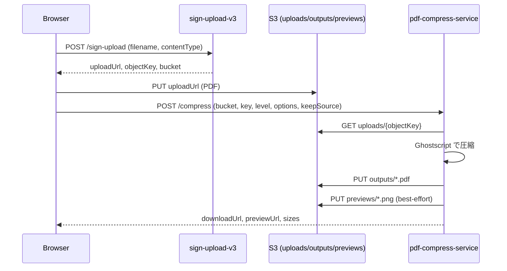
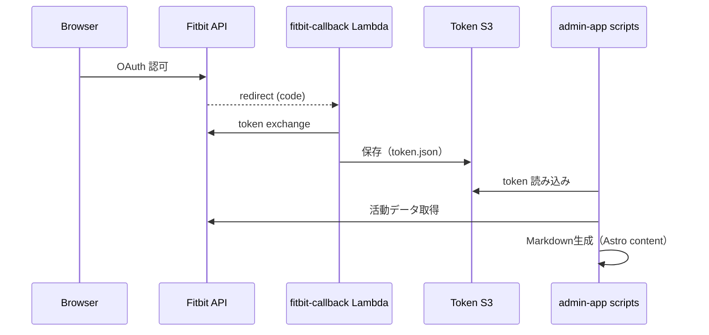

# アーキテクチャ概要

このリポジトリは、Astro 静的サイト（公開サイト）、管理用ツール群、Fitbit連携のLambda群、PDF圧縮サービス（Docker/Lambda）で構成されます。公開サイトは静的配信、ツールはAPIと外部サービス連携を前提としています。

## 全体像

```mermaid
flowchart LR
  subgraph Public[公開サイト]
    Astro[astro-blog
静的サイト]
    CF[CloudFront]
    S3Site[S3 静的ホスティング]
  end

  subgraph Admin[運用・作成]
    AdminApp[admin-app
(EJS/Express)]
    Scripts[管理スクリプト]
  end

  subgraph Fitbit[Fitbit連携]
    FitbitAPI[Fitbit API]
    Callback[fitbit-callback Lambda]
    TokenS3[Token S3]
  end

  subgraph PDF[PDF圧縮]
    Sign[sign-upload-v3 Lambda]
    Compress[pdf-compress-service
(Lambda/Docker + Ghostscript)]
    UploadS3[S3 uploads/outputs/previews]
  end

  User[Browser] --> CF --> S3Site --> Astro
  AdminApp --> Scripts --> Astro
  User --> Sign --> UploadS3
  User --> Compress --> UploadS3
  Callback --> TokenS3
  Scripts --> TokenS3
  Scripts --> FitbitAPI
```

## URL設計と404方針
- `/` はツールへのハブページ。
- ブログUIは `/blog/` に集約（記事URLは `/<slug>/` のまま）。
- 正規ルート（例）: `/`, `/blog/`, `/running-pace/`, `/pdf-compress/`, `/contact/`, `/privacy/`。
- `/blog` や `/pace` は正規ルートではなく 404 が正しい挙動。
- CloudFront配下の存在しないURLは **HTTP 404** を返す（soft 404回避）。
- 404ページは Astro が生成する `/404.html` 相当の内容を返す。
- 404ページは **canonical を出さない**、`robots` は **noindex,follow**。

## SEO / AdSense 方針
- canonical は正規URLに対してのみ出力。
- 404ページは noindex,follow。
- sitemap は Astro 側で生成（`sitemap.xml.ts`）。
- UI文言は日本語に統一し、信頼性/透明性の説明（about/contact/privacy）を明示。

## PDF圧縮のデータフロー



## Fitbit連携のデータフロー


