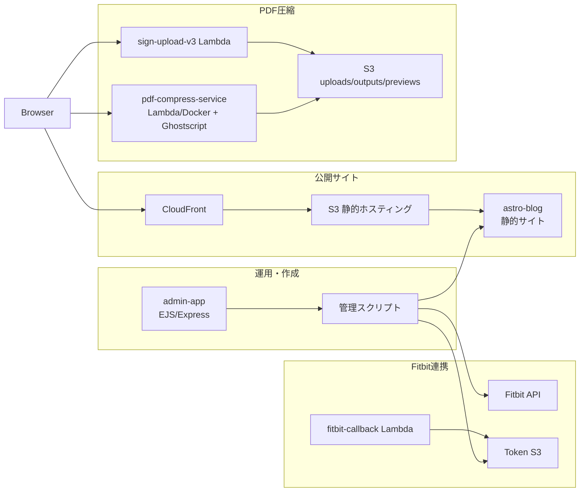
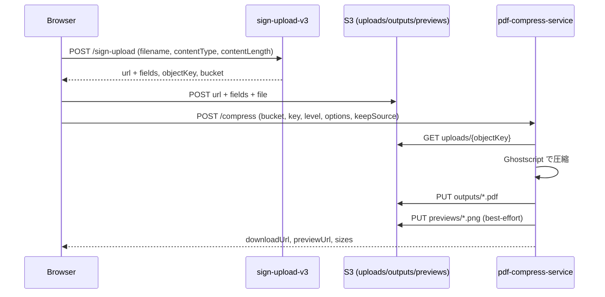
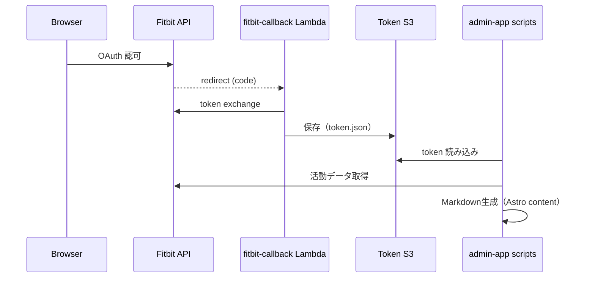

# アーキテクチャ概要

このリポジトリは、Astro 静的サイト（公開サイト）、管理用ツール群、Fitbit連携のLambda群、PDF圧縮サービス（Docker/Lambda）で構成されます。公開サイトは静的配信、ツールはAPIと外部サービス連携を前提としています。
運用上のガードレール（同時実行・TTL・サイズ上限・CORSなど）は `docs/ops-parameters.md` に集約しています。
フロントの検証用には、ブログ記事生成を省略する `ASTRO_BUILD_NO_POSTS=1` のクイックビルドを利用できます。

## 全体像

```mermaid
flowchart LR
  subgraph Public[公開サイト]
    Astro["astro-blog<br/>静的サイト"]
    CF[CloudFront]
    S3Site[S3 静的ホスティング]
  end

  subgraph Admin[運用・作成]
    AdminApp["admin-app<br/>EJS/Express"]
    Scripts[管理スクリプト]
  end

  subgraph Fitbit[Fitbit連携]
    FitbitAPI[Fitbit API]
    Callback[fitbit-callback Lambda]
    TokenS3[Token S3]
  end

  subgraph PDF[PDF圧縮]
    Sign[sign-upload-v3 Lambda]
    Compress["pdf-compress-service<br/>Lambda/Docker + Ghostscript"]
    UploadS3[S3 uploads/outputs/previews]
  end

  User[Browser] --> CF --> S3Site --> Astro
  AdminApp --> Scripts --> Astro
  User --> Sign --> UploadS3
  User --> Compress --> UploadS3
  Callback --> TokenS3
  Scripts --> TokenS3
  Scripts --> FitbitAPI
```

## URL設計と404方針
- `/` はツールへのハブページ。
- ブログUIは `/blog/` に集約（記事URLは `/<slug>/` のまま）。
- `/draw/` は「30秒お絵描き採点ゲーム」のフロントページ。`/draw/archive/`（月別Top20）・`/draw/play/`・`/draw/result/` を含む。
- `/games/` は軽量なミニゲーム集のハブ。`/games/janken/`、`/games/snake/`、`/games/maze/`、`/games/tic-tac-toe/`、`/games/reversi/` を含む。
- `/games/janken/` は `チャットさん` 対戦と `1対1` モードを持つ。`チャットさん` 対戦は約1秒の思考演出のあとに1回勝負を公開し、`1対1` は順番に手を選んでから同時公開する。
- `/games/snake/` は `おそい / ふつう / はやい` の3速度モードを持ち、選んだ速度は次に「開始 / 再スタート」を押したときに反映される。
- `/games/maze/` と `/games/snake/` は、キーボード・タッチに加えて Gamepad API 入力も受け付ける。想定環境は Android の Chrome 系ブラウザで、D-pad と左スティックで移動し、主要ボタンで開始/再開系の操作を行う。
- 同2ページでは方向入力を常にゲーム優先として扱い、矢印キー相当のコントローラ入力でブラウザ画面がスクロールしたり、フォーカス移動が起きたりしないよう抑止する。
- `/games/` 系は専用の Service Worker により静かにオフライン対応する。訪問後に `/games/` と各ゲームページ、および必要な静的アセットをキャッシュし、他のルートや API には作用させない。
- 正規ルート（例）: `/`, `/blog/`, `/running-pace/`, `/pdf-compress/`, `/contact/`, `/privacy/`。
- `/running-pace/` は同一ページ内に `#calculator`（計算）と `#table`（表）のアンカーを持つ。
- `/blog` や `/pace` は正規ルートではなく 404 が正しい挙動。
- CloudFront配下の存在しないURLは **HTTP 404** を返す（soft 404回避）。
- 404ページは Astro が生成する `/404.html` 相当の内容を返す。
- 404ページは **canonical を出さない**、`robots` は **noindex,follow**。

## SEO / AdSense 方針
- canonical は正規URLに対してのみ出力。
- 404ページは noindex,follow。
- sitemap は Astro 側で生成（`sitemap.xml.ts`）。
- UI文言は日本語に統一し、信頼性/透明性の説明（about/contact/privacy）を明示。
- ランニング記事のうち `練習(弱)` `練習(中)` `練習(デフォルト)` は、個別記事ページを `noindex,follow` にする。
- 月次サマリー記事（slug に `-summary-` を含むもの）も個別記事ページを `noindex,follow` にする。
- 上記3カテゴリの記事は sitemap から除外する。
- 月次サマリー記事も sitemap から除外する。
- ただし `/blog/` や `/archive/` などの一覧ページには残し、人向けの導線は維持する。

## 30秒お絵描き採点ゲーム（フロント + API）
- `/draw/` → `/draw/play/` → `/draw/result/` の3ページ構成。
- 画像アップロード・採点・ランキングは **API Gateway + Lambda** のバックエンドで提供。
- フロントは `PUBLIC_DRAW_API_BASE` を用いて `/api/draw/*` を呼び出す。
- お題は `GET /api/draw/prompt` でサーバーが月次決定（JST、`2026-02` を基準月として36題を順送り）。
- 画像は S3 にアップロードし、閲覧は CloudFront 署名URL（900秒）で返す。
- 一次審査の表示は「点数 + 4文の講評 + tips + breakdown」で完結する。
- 共有カード画像はブラウザ内の Canvas で生成してPNG保存する。
- `/draw/archive/` は 2026-02 以降の各月Top20をクライアント側で取得して表示する。
- `/draw/archive/` の各ランキングカードはクリックで詳細モーダルを開き、`GET /api/draw/submission?promptId=...&submissionId=...` から画像・点数・breakdown・講評・tips・お題・投稿日を取得して表示する。
- `/draw/` 系は sitemap に含める。グローバルナビから「お絵かきゲーム」として導線を提供する。
- `/games/` 系も sitemap に含める。グローバルナビには「ミニゲーム」を追加し、`/draw/` は独立導線のまま維持する。
- オフライン対応は install 訴求や専用案内を出さず、通常の閲覧体験のまま有効化する。
- 一次採点は OpenAI GPT-5 mini（`reasoning.effort=minimal`、JSON出力）を使用、失敗時はスタブにフォールバック。
- 一次の最終 score は server-side で rubric の weighted average を主軸に、軽い structural bonus / penalty を加えて 20〜100 に収める。
- token usage と推定コストは DrawSubmissions に保存し、AWS外モデルでも後から集計できるようにする。
- 画像保管は当月は全件保持し、毎月1日の月次ジョブで「前月Top20以外」を削除する。

## PDF圧縮のデータフロー
- PDFアップロードは最大50MBまで（S3のpresigned POSTポリシーで強制）。
- downloadUrl / previewUrl の有効期限はデフォルト10分（DOWNLOAD_URL_TTLで変更可）、uploadUrlもデフォルト10分（UPLOAD_URL_TTL）。

```mermaid
sequenceDiagram
  participant User as Browser
  participant Sign as sign-upload-v3
  participant S3 as S3 (uploads/outputs/previews)
  participant Compress as pdf-compress-service

  User->>Sign: POST /sign-upload (filename, contentType, contentLength)
  Sign-->>User: url + fields, objectKey, bucket
  User->>S3: POST url + fields + file
  User->>Compress: POST /compress (bucket, key, level, options, keepSource)
  Compress->>S3: GET uploads/{objectKey}
  Compress->>Compress: Ghostscript で圧縮
  Compress->>S3: PUT outputs/*.pdf
  Compress->>S3: PUT previews/*.png (best-effort)
  Compress-->>User: downloadUrl, previewUrl, sizes
```

## Fitbit連携のデータフロー

```mermaid
sequenceDiagram
  participant User as Browser
  participant Fitbit as Fitbit API
  participant CB as fitbit-callback Lambda
  participant S3 as Token S3
  participant Admin as admin-app scripts

  User->>Fitbit: OAuth 認可
  Fitbit-->>CB: redirect (code)
  CB->>Fitbit: token exchange
  CB->>S3: 保存（token.json）
  Admin->>S3: token 読み込み
  Admin->>Fitbit: 活動データ取得
  Admin->>Admin: Markdown生成（Astro content）
```
