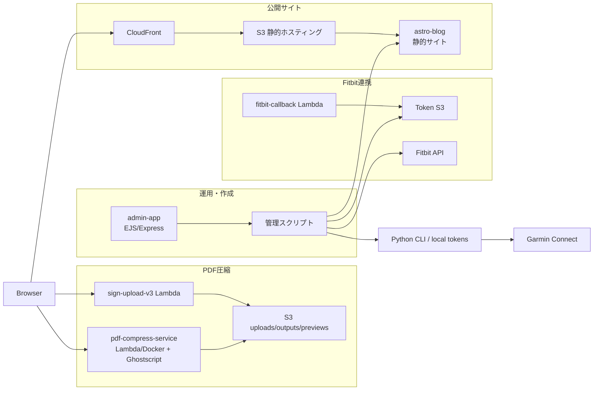
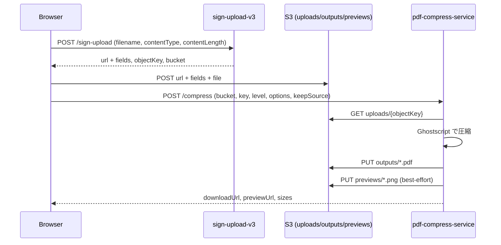
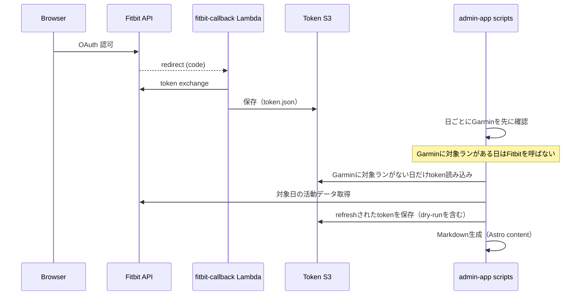

# アーキテクチャ概要

このリポジトリは、Astro 静的サイト（公開サイト）、管理用ツール群、Fitbit連携のLambda群、PDF圧縮サービス（Docker/Lambda）で構成されます。公開サイトは静的配信、ツールはAPIと外部サービス連携を前提としています。
運用上のガードレール（同時実行・TTL・サイズ上限・CORSなど）は `docs/ops-parameters.md` に集約しています。
フロントの検証用には、ブログ記事生成を省略する `ASTRO_BUILD_NO_POSTS=1` のクイックビルドを利用できます。ブログ記事一覧は `astro-blog/src/lib/blog-index.ts` に集約し、ビルド中に同じ content collection を何度も組み立てないようにしています。出力互換性の確認には `.dist-baseline` と `dist` を `npm run compare:dist --prefix astro-blog` で比較します。
Astroサイトの本番デプロイは CodeBuild から S3 + CloudFront へ行います。CodeBuild は Node.js 20 runtime と npm cache を使い、月次サマリーは `{YYYY-MM}-summary.md` の安定slugで生成します。HTMLとハッシュ付きJS/CSSの世代ずれを防ぐため、`dist/_astro` を先にアップロードして旧世代も保持し、その後に `_astro/*` を除外した残りの成果物を `--delete` 付きで同期します。HTMLは同一サイズでも内容が変わり得るため `--size-only` を使いません。CloudFrontの全パス無効化は完了まで待機し、本番の結果ページが今回のassetを参照してHTTP 200で取得できることを自動確認します。

## 全体像

```mermaid
flowchart LR
  subgraph Public[公開サイト]
    Astro["astro-blog<br/>静的サイト"]
    CF[CloudFront]
    S3Site[S3 静的ホスティング]
  end

  subgraph Admin[運用・作成]
    AdminApp["admin-app<br/>EJS/Express"]
    Scripts[管理スクリプト]
  end

  subgraph Fitbit[Fitbit連携]
    FitbitAPI[Fitbit API]
    Callback[fitbit-callback Lambda]
    TokenS3[Token S3]
  end

  GarminAPI[Garmin Connect]
  GarminLocal[Python CLI / local tokens]

  subgraph PDF[PDF圧縮]
    Sign[sign-upload-v3 Lambda]
    Compress["pdf-compress-service<br/>Lambda/Docker + Ghostscript"]
    UploadS3[S3 uploads/outputs/previews]
  end

  User[Browser] --> CF --> S3Site --> Astro
  AdminApp --> Scripts --> Astro
  User --> Sign --> UploadS3
  User --> Compress --> UploadS3
  Callback --> TokenS3
  Scripts --> TokenS3
  Scripts --> FitbitAPI
  Scripts --> GarminLocal --> GarminAPI
```

## URL設計と404方針
- `/` は PDF圧縮、ペース計算、お絵かきゲーム、ミニゲーム、ブログへのハブページ。
- `/` はWebP化した生成画像を含むビジュアルハブとして、主要コンテンツへの導線をファーストビューと直下に配置する。生成画像は補助的な視覚要素であり、意味のあるラベルやCTAはHTMLテキストで提供する。
- ブログUIは `/blog/` に集約（記事URLは `/<slug>/` のまま）。
- `/draw/` は「30秒お絵描き採点ゲーム」のフロントページ。`/draw/archive/`（月別Top20）・`/draw/play/`・`/draw/result/` を含む。
- `/games/` は軽量なミニゲーム集のハブ。`/games/balloon-catch/`、`/games/cushion-catch/`、`/games/tv-catch/`、`/games/window-catch/`、`/games/dressup/`、`/games/dressup-next/`、`/games/match-quiz/`、`/games/janken/`、`/games/clock/`、`/games/snake/`、`/games/maze/`、`/games/tic-tac-toe/`、`/games/reversi/`、`/games/music/` を含む。
- `/games/music/` は4モードを同じページで遊ぶ静的ゲーム。音符読み（ト音記号・ヘ音記号）、4/4の音符と休符を叩くリズム、単音の聞き分け、短い旋律の再現を各10問または10小節で終える。MIDI番号・音名・オクターブと譜面表記を分離したモデル、12半音対応の共通鍵盤（初期表示は白鍵）、SVG譜面、Web Audio APIの合成音、`performance.now()` によるリズム判定を使う。アカウント・通信・保存は使わない。
- 音楽ゲームの音部記号と四分休符は SMuFL 準拠の Bravura 字形から取り出した軽量 SVG 輪郭を使い、ト音記号の渦を第2線 G4、ヘ音記号の太い点と上下の小点を第4線 F3 に合わせる。単独音符の符幹は、両音部記号とも第3線上とそれより上では左側から下向き、第3線より下では右側から上向きに描く。リズムは明示的な開始操作の後、最初に4拍、各小節間に2拍の譜面プレビューを置く。最初の小節は四分休符2つから始まり、以後も各小節の1拍目は四分休符にする。10小節分の譜面はプレイ前にランダム生成し、プレビュー・表示・判定で同じ譜面を使う。合成音は MIDI 60=C4、69=A4=440Hz の12平均律に固定する。
- `/games/balloon-catch/` は「ふうせんゲーム」。30秒で、犬を左右に動かしてCPUキャラクターが投げる風船をキャッチする。`おそい / ふつう / はやい` の難易度で投げる間隔・速度・同時数・横揺れを変え、犬は生成済みスプライトシートのみを使って描画する。スマートフォン横向きでも遊びやすいように「大きくあそぶ」表示を持ち、Fullscreen API が使える環境では全画面、使えない環境では CSS オーバーレイでゲーム画面を広く表示する。
- `/games/cushion-catch/` は「クッションゲーム」。30秒で、同じ犬を左右に動かし、わるいひとが投げたクッションを最初のワンバウンド後にキャッチする。粗いポインターのタッチ端末では左右・キャッチボタンを隠し、タップ/ドラッグで移動しつつ、バウンド済みクッションが範囲内にあるときのタップをキャッチとして扱う。細かいポインター、キーボード、ゲームパッドでは従来のボタンまたは入力を維持する。`やさしい` は未就学児向けに投球を遅く、犬を速く、着地点を中央寄り、キャッチ範囲を広くし、2回目の着地後も短時間キャッチできる。`ふつう / むずかしい` は2回目の着地で従来どおり取り逃しになる。着地点表示、通常/キラキラクッション、3連続キャッチで得点が倍になる「ふわふわタイム」、減点なしの取り逃し、消音可能なWeb Audio効果音、難易度別ローカルベストを持つ。「大きくあそぶ」はふうせんゲームと同じ全画面/CSSオーバーレイ方式とする。
- `/games/tv-catch/` は「テレビゲーム」。30秒で、わるいひとが棚のテレビへ近づいて接触すると、テレビがランダムな落下地点へ跳ね上がる。同じ犬を左右に動かし、落下中のテレビに重なると自動でキャッチして1点を得る。テレビは1台ずつ出現し、`おそい / ふつう / はやい` で接近時間と落下時間を変える。取り逃しは減点せず、テレビは壊れずに床で柔らかく跳ねて消える。キーボード、タッチ、ゲームパッド入力と、ふうせんゲームと同じ「大きくあそぶ」に対応する。
- `/games/window-catch/` は「まどゲーム」。昼のマンション1棟にある上層階8枚の窓から、雲に乗ったコミカルないたずら者が1枚へ近づき、予告として窓を揺らしてからほぼ真下へ落とす。キャッチ後またはミスの床バウンド後、いたずら者は固定位置へ飛ばず、その場から連続して画面外へ飛び去ってから次のラウンドへ進む。象を地上で左右に動かし、広めの全身判定に窓が重なると、象が鼻を上げる仕草で自動キャッチして1点を得る。30秒、`おそい / ふつう / はやい`、ミスの減点なし、壊れない柔らかな床バウンド、キーボード・タッチ・ゲームパッド入力と「大きくあそぶ」に対応する。
- `/games/match-quiz/` は「えあわせクイズ」。画像を見て答えを4択で選ぶローカル保存型のクイズで、サンプルセットから即開始できる。開始導線は本文内の主ボタンに集約し、管理画面では読み取り専用のサンプルセットと、自作のローカルセット作成・削除、および自作セット内の問題追加・削除を扱う。カード保存は repository 層経由、出題生成は UI から分離したロジックで行う。
- `/games/dressup/` は「おしゃれゲーム」。テーマに合わせてコーデを作り、各部位に `なし` を含む選択肢から着せ替える。チャットさんは髪飾りから順に各部位を約2秒ずつかけて選び、最後は点数ではなく「どっちがすき？」を選んで遊ぶ。
- `/games/dressup-next/` は PNG レイヤー版おしゃれゲームの公開ルート。既存 `/games/dressup/` は置き換えず、プレイヤーとチャットさんで共有するベースモデル選択を持ち、衣装・小物アセットは変えず、アイテムカタログ生成から独立した `dressup-next-models.json` で位置補正を管理する。頭・首元・腰・左右の足首を拡大縮小の基準にし、モデルごとの部位共通補正へアイテムの部分補正を重ねる。各部位に画像プレビュー付きの約20種類の選択肢と部位内の前後ページ送りを持ち、完成後は編集用ホットスポットを隠し、チャットさんが部位ごとに選ぶ様子を表示してから「どっちがすき？」を選んで遊ぶ。sitemap と games Service Worker のナビゲーション/画像キャッシュ対象に含める。
- `/games/janken/` は `チャットさん` 対戦と `1対1` モードを持つ。`チャットさん` 対戦は約1秒の思考演出のあとに1回勝負を公開し、`1対1` は順番に手を選んでから同時公開する。
- `/games/clock/` はお題の時こくに合わせてアナログ時計の長針・短針を直接ドラッグして合わせる。長針が12をまたぐと短針側の時間も進退し、`やさしい / ふつう / むずかしい` で、ちょうどの時間 / 30分まで / 5分刻みへ出題範囲を広げる。正誤判定は `こたえる` ボタン押下時に行い、正解後は `つぎの もんだい` で進む。
- `/games/reversi/` はチャットさん対戦と2人対戦に対応し、合法手がない側は自動パス、両者の連続パスで終了する。AIの遅延手番は盤面更新前に消費してから次の手番を予約するため、パス後のAI手番予約を上書きしない。
- `/games/snake/` は `おそい / ふつう / はやい` の3速度モードを持ち、選んだ速度は次に「開始 / 再スタート」を押したときに反映される。
- `/games/balloon-catch/`、`/games/cushion-catch/`、`/games/tv-catch/`、`/games/window-catch/`、`/games/maze/`、`/games/snake/` は、キーボード・タッチに加えて Gamepad API 入力も受け付ける。想定環境は Android の Chrome 系ブラウザで、D-pad と左スティックで移動し、主要ボタンで開始/再開系の操作を行う。クッションゲームでは主要ボタンをキャッチにも使う。
- 同5ページでは方向入力を常にゲーム優先として扱い、矢印キー相当のコントローラ入力でブラウザ画面がスクロールしたり、フォーカス移動が起きたりしないよう抑止する。
- `/games/` 系は専用の Service Worker により静かにオフライン対応する。訪問後に `/games/` と各ゲームページ、および必要な静的アセットをキャッシュし、他のルートや API には作用させない。
- 正規ルート（例）: `/`, `/blog/`, `/running-pace/`, `/pdf-compress/`, `/contact/`, `/privacy/`。
- `/running-pace/` は同一ページ内に `#calculator`（計算）と `#table`（表）のアンカーを持つ。
- `/blog` や `/pace` は正規ルートではなく 404 が正しい挙動。
- CloudFront配下の存在しないURLは **HTTP 404** を返す（soft 404回避）。
- 404ページは Astro が生成する `/404.html` 相当の内容を返す。
- 404ページは **canonical を出さない**、`robots` は **noindex,follow**。

## SEO / AdSense 方針
- HTML の言語指定は日本語サイトとして `ja` に統一する。
- canonical は正規URLに対してのみ出力。
- 404ページは noindex,follow。
- sitemap は Astro 側で生成（`sitemap.xml.ts`）。
- AdSense 用 `ads.txt` は `astro-blog/public/ads.txt` から `/ads.txt` として静的配信する。
- AdSense 審査向けに、トップページと About で PDF圧縮、ペース計算、お絵かきゲーム、ミニゲーム、ブログを主要コンテンツとして明示する。
- AdSense 審査向けに、Privacy では Google と第三者配信事業者の広告 Cookie、パーソナライズ広告、オプトアウト導線、お絵かきゲームの画像/ランキングデータの扱いを明示する。
- `/draw/` と `/games/match-quiz/` は、インタラクティブ UI だけでなく、遊び方・データの扱い・向いている場面などの本文を持つ。
- Contact は X を唯一の公開連絡先とし、不具合報告、削除依頼、プライバシー、広告 Cookie 関連問い合わせを受け付けることを明示する。
- UI文言は日本語に統一し、信頼性/透明性の説明（about/contact/privacy）を明示。
- ランニング記事のうち `練習(弱)` `練習(中)` `練習(デフォルト)` は、個別記事ページを `noindex,follow` にする。
- 月次サマリー記事（slug に `-summary-` を含むもの、または `-summary` で終わるもの）も個別記事ページを `noindex,follow` にする。
- 上記3カテゴリの記事は sitemap から除外する。
- 月次サマリー記事も sitemap から除外する。
- ただし `/blog/` や `/archive/` などの一覧ページには残し、人向けの導線は維持する。
- `/archive/` は公開済み記事を年月別に表示し、各記事のカテゴリ表示と `category` クエリによるカテゴリ絞り込みを提供する。
- サイドバーのカテゴリ別一覧は直近記事に制限し、古いカテゴリ記事は `/archive/?category=...` へ誘導する。

## 30秒お絵描き採点ゲーム（フロント + API）
- `/draw/` → `/draw/play/` → `/draw/result/` の3ページ構成。
- 画像アップロード・採点・ランキングは **API Gateway + Lambda** のバックエンドで提供。
- フロントは `PUBLIC_DRAW_API_BASE` を用いて `/api/draw/*` を呼び出す。
- フロントのAPI通信にはタイムアウトを設け、結果画面は保存済み採点結果をお題・ランキングの取得成否から独立して表示する。部分的な取得失敗は無期限の読み込み表示にせず、エラーと再試行導線を表示する。
- お題は `GET /api/draw/prompt` でサーバーが月次決定（JST、`2026-02` を基準月として36題を順送り）。
- 画像は S3 にアップロードし、閲覧は CloudFront 署名URL（900秒）で返す。
- 点数と4軸を先に表示し、非同期の4文講評とtipsを追記する。講評表示は「おとなむけ」と「こどもむけ」を選べるが、採点用 rubric、点数、breakdown、順位は作品ごとに1つだけを共有し、表示モードによって変えない。
- 30秒のキャンバスは黒に近いペンですぐ描き始められ、ワンタップの色選択・白の消しゴム・1手戻す操作を備える。送信するPNGは白背景の不透明画像とし、既存のアップロード・採点契約は変えない。
- 「こどもむけ」は漢字を使わない未就学児向けの平易な講評・tips・結果ラベルだけを表示し、通常講評と同時表示しない。選択はブラウザに保存し、新規結果画面とアーカイブ詳細モーダルで共通利用する。
- 新規投稿では採点を確定した後、別の非同期Responses応答から通常講評とこども向け講評を保存する。アーカイブ閲覧時にはAI生成を行わない。
- 共有カード画像はブラウザ内の Canvas で生成してPNG保存する。
- `/draw/archive/` は 2026-02 から前月（JST）までの確定済み各月Top20をクライアント側で取得して表示する。当月は確定前のため表示しない。
- アーカイブの確定済みTop20は画面幅に応じた作品ギャラリーとして並べ、詳細は従来どおり選択時に取得する。追加の画像・API取得は行わない。
- フロントはAPIの `rankingEligible` に従い、過去月の結果を練習記録として表示してランキング取得を省略する。
- `/draw/archive/` の各ランキングカードはクリックで詳細モーダルを開き、`GET /api/draw/submission?promptId=...&submissionId=...` から画像・点数・breakdown・講評・tips・お題・投稿日を取得して表示する。
- ランキング対象は当月（JST）の投稿だけとする。過去月のお題は練習として遊べるが、投稿はランキング対象外として短期保持し、通常のランキングGSIには登録しない。
- ランキングが開いている間の順位の正本は GSI1 の `scoreSortKey` 順とする。投稿詳細も保存済みの順位を正本にせず、同じ並びから順位を算出する。月次確定時だけTop20の順位スナップショットを保存する。
- 月次確定では前月のTop20を長期保持し、Top20以外の通常投稿をランキングGSIから除外するとともに、対応する画像を削除する。これによりアーカイブは確定後に変動しない。
- 月次ジョブは UTC の日付境界によるずれを避けるため毎日実行し、JSTの1日のみ月次確定を行う。それ以外の日は期限切れの練習画像だけを整理する。手動実行時は対象月を明示できる。
- `/draw/` 系は sitemap に含める。グローバルナビから「お絵かきゲーム」として導線を提供する。
- `/games/` 系も sitemap に含める。グローバルナビには「ミニゲーム」を追加し、`/draw/` は独立導線のまま維持する。
- オフライン対応は install 訴求や専用案内を出さず、通常の閲覧体験のまま有効化する。
- 一次採点は OpenAI Decisions GPT-6 Lunaでrubric-v2 MAP段階を取得しFで得点化する。失敗は503、既存投稿の点数は自動更新しない。講評はSQS経由のGPT-6 Luna / none Responsesで非同期生成する。
- 最終scoreはサーバーでMAP段階からscore-v2基礎点→Fの固定換算を計算し、0〜100の整数へ丸める。
- token usage（通常入力・キャッシュ入力・キャッシュ書き込み・出力）と推定コストは DrawSubmissions に保存し、AWS外モデルでも後から集計できるようにする。
- 画像保管は当月のランキング対象投稿を全件保持し、毎月の確定ジョブで「前月Top20以外」を削除する。過去月の練習投稿は別prefixで短期保持する。

## PDF圧縮のデータフロー
- PDFアップロードは最大50MBまで（S3のpresigned POSTポリシーで強制）。
- downloadUrl / previewUrl の有効期限はデフォルト10分（DOWNLOAD_URL_TTLで変更可）、Upload URLもデフォルト10分（UPLOAD_URL_TTL）。

```mermaid
sequenceDiagram
  participant User as Browser
  participant Sign as sign-upload-v3
  participant S3 as S3 (uploads/outputs/previews)
  participant Compress as pdf-compress-service

  User->>Sign: POST /sign-upload (filename, contentType, contentLength)
  Sign-->>User: url + fields, objectKey, bucket
  User->>S3: POST url + fields + file
  User->>Compress: POST /compress (bucket, key, level, options, keepSource)
  Compress->>S3: GET uploads/{objectKey}
  Compress->>Compress: Ghostscript で圧縮
  Compress->>S3: PUT outputs/*.pdf
  Compress->>S3: PUT previews/*.png (best-effort)
  Compress-->>User: downloadUrl, previewUrl, sizes
```

## Fitbit連携のデータフロー

```mermaid
sequenceDiagram
  participant User as Browser
  participant Fitbit as Fitbit API
  participant CB as fitbit-callback Lambda
  participant S3 as Token S3
  participant Admin as admin-app scripts

  User->>Fitbit: OAuth 認可
  Fitbit-->>CB: redirect (code)
  CB->>Fitbit: token exchange
  CB->>S3: 保存（token.json）
  Admin->>Admin: 日ごとにGarminを先に確認
  Note over Admin: Garminに対象ランがある日はFitbitを呼ばない
  Admin->>S3: Garminに対象ランがない日だけtoken読み込み
  Admin->>Fitbit: 対象日の活動データ取得
  Admin->>S3: refreshされたtokenを保存（dry-runを含む）
  Admin->>Admin: Markdown生成（Astro content）
```

Fitbitはrefresh時にrefresh tokenもローテーションするため、管理スクリプトは記事生成のdry-run中でも更新されたtokenをS3へ保存する。dry-runが抑止するのはMarkdown記事の書き込みであり、認証情報の更新は抑止しない。

ブログ記事の日時は公開サイトの基準タイムゾーンである `Asia/Tokyo` として扱い、管理UIと新規生成スクリプトは `+09:00` 付きISO 8601をfrontmatterの `date` に保存する。管理UIは日付と時刻を必須入力とし、既存記事を編集しても保存済み時刻を日付だけへ丸めない。

Fitbit取込は日次活動データの `startTime` を使い、1日に複数の対象ランがある場合は最も早い開始時刻を記事日時とする。有効な開始時刻が1件もない場合は、推測した0時の記事を生成せず警告する。走行開始時刻を持たない月次サマリーは、記事ページでは日付だけを表示する。

Fitbit記事の各Workoutは、日次活動データの総距離を小数第2位へ丸めて `31分ジョグ(6.01km)` の形式で表示する。距離が取得できない場合は距離の括弧を省略し、スプリットが取得できない場合は「スプリットなし」などの補足行を出力しない。

ラン判定はRun系の活動名に加えてActivity ID `91060` を既定対象とし、Fitbitがランを `Workout` として返す場合も取り込む。環境変数 `FITBIT_RUN_ACTIVITY_NAMES` / `FITBIT_RUN_ACTIVITY_IDS` で既定値を上書きできる。

日付範囲の連続取込では、対象Activityが5日連続で見つからない場合は同期不良や判定漏れの可能性があるため、その時点で処理を停止する。閾値は `FITBIT_MAX_CONSECUTIVE_EMPTY_DAYS` で変更できる。

Fitbit APIがHTTP 429または `RESOURCE_EXHAUSTED` を返した場合も、後続日付への無駄な再試行を避けるため、その時点で日付範囲の取込を停止する。

### Garmin / Fitbit両対応の記事取込

`admin-app/scripts/import-workouts.js` が共通入口となり、従来の `import-fitbit-workouts.js` も同じ処理へ委譲する。日付指定・期間指定は維持し、既定日付は基準タイムゾーンの今日、重複日付は1回だけ処理する。既定の `--source auto` は日単位でGarminを先に検索し、30秒以上の対象ランが1件でもあればその日のFitbitは取得しない。GarminとFitbitの両方で同日に別のランを記録した場合も、その日はGarminのみを採用する。Garmin検索が成功して対象ラン0件の日だけFitbitを取得する。`--source garmin` / `--source fitbit` で明示的に限定できる。

Garminの認証切れ・通信失敗・rate limit・不正データを「ランなし」と扱わない。その日の記事は生成せず、後続日の処理も停止して非0終了する。Fitbitの設定確認とS3 token読み込み・refreshはFitbitの取得が必要になった時だけ行い、Garminだけの日にはAWSやFitbit認証を必要としない。Fitbit取得エラーも範囲取込を停止して非0終了する。対象ランが5日連続でない場合の停止も非0終了とする。

記事のfrontmatter、分数ジョグ(距離km)、スプリットの矢印・5区間ごとの折り返し・最終累積距離ラベルは維持し、心拍・GPS・パワーなどの本文項目は追加しない。Garminの秒・メートルはms・kmへ変換し、開始時刻は `startTimeGMT` から基準オフセットへ変換する。記録された1kmラップと最終端数を表示するが、1kmに揃わないラップは推測で分割せず省略し、ラップ詳細404もスプリットを省略する。

両ソースとも従来の `YYYY-MM-DD-fitbit-workout.md` を使い、URLと既存記事を維持する。同日の既存取込記事（番号付きの過去ファイルも含む）がある場合はAPI取得前にスキップし、上書きや番号付き再生成をしない。`--dry-run` または従来の環境変数で記事書き込みを抑止し、確認用Markdownを表示する。使用ソースのtoken refreshはdry-runでも永続化する。

Fitbitの64bit `logId` は文字列として保持して詳細取得URLへ渡す。TCXに総時間・総距離のlapしかない場合、それを均等割りして架空の1kmスプリットを生成しない。記録済み1kmラップまたは距離サンプルがある場合だけスプリットを出力する。
Fitbit詳細取得の401/429/5xxも停止対象とし、403/404等の未提供・スコープ不足ではスプリットを省略できる。

## Garmin詳細データのローカル取得

`admin-app/scripts/garmin.sh` / `garmin.py` は、非公式の `python-garminconnect` 0.3.16を使い、個人アカウントから指定日のランニング詳細を取得するCLIである。Python 3.12以上と、固定依存をインストールした `admin-app/.venv-garmin` を使用する。Garmin側の変更で動かなくなる可能性がある。

初回認証はユーザー自身がTTYでメールアドレス、非表示のパスワード、必要なら非表示のMFAコードを入力する。パスワードは保存せず、認証tokenを `~/.garminconnect/garmin_tokens.json` に保存する。取得コマンドは保存済みtokenだけを使い、認証が必要な場合は入力待ちに切り替えず終了する。tokenの自動更新も同じ場所へ永続化する。

指定日はGarminのローカル日付として検索する。summary・splits・details JSON、元のFITを含むZIP、TCXを `~/.garminconnect/activities/{YYYY-MM-DD}/` に保存し、結果と部分失敗を `manifest.json` に記録する。保存ディレクトリは0700、ファイルは0600とし、秘密値やAPIエラー本文をログへ出さない。認証エラー・rate limitは取得処理を停止する。

`import-data --date` はラン・ラップの必要項目だけをJSONでstdoutへ返し、詳細ZIP/TCXは保存しない。Python CLIはGarminの活動変更・削除・アップロード、AWS・公開サイト・Astro記事への書き込みを行わない。Node importerが記事生成と日単位の重複排除を担当する。詳細の有無は実データで確認し、未取得の値やスプリットを推測しない。準備・認証・取得手順は `docs/runbooks/garmin-local.md` を参照。

## お絵描き評価基盤（ローカル）

`tools/draw-evaluation/` は本番と独立した Node.js ツール。DynamoDB/S3を読み取り専用で取得し、画像と作品、独立した評価履歴、人間レビューをローカル保存する。採点APIは呼ばず、Codexのサブスクリプションで GPT-6.1 Sol low が画像とお題を見て作成したJSONを検証して取り込む。rubric-v1 はお題らしさ・構造・完成度の5段階、score-v1 は50/30/20の決定論的配点。評価は暫定referenceであり、人間が「妥当」と確認した評価のみを使う比較も選べる。過去Top20保存による選択偏りを記録する。起動・評価手順は [評価ツール](../tools/draw-evaluation/README.md) を参照。

評価ラボは、選択した版の未レビュー初回referenceのうち90点以上・confidence low・既存点数との差25点以上を優先表示する。理由と残件数を表示し、レビュー済み作品は優先一覧から外す。これは確認順の提案であり、不適切判定や採点の自動修正ではない。

評価ラボの実験rubric-v2は4軸（お題らしさ・特徴の表現・形の整合性・仕上がり）各0〜6。段階3〜4を通常の成立、6を可視的根拠のある例外的な出来とし、score-v2は段階変換0/10/25/45/65/82/100と重み40/25/20/15、識別段階による上限15/35/55を使う。旧v1と人間レビューを保持し、版ごとに表示・採点・集計する。レビューで指摘された作品をv2の確認候補にするが、旧レビューをv2へ転記しない。反復評価は独立した新しい評価として追記する。v2はレビュー作品を使った改善実験であり、独立標本での検証や本番採用は別途必要。

評価指示だけの比較はprompt-v3 / rubric-v2 / score-v2で行う。軸・0〜6の段階定義・点数変換は固定し、類似対象との識別、描かれた全体の品質、明確に良い作品への段階5を評価指示で明確化する。v2レビュー済みの問題作品と妥当な対照作品をblindに再評価する。UIはrubricだけでなくprompt/rubric/scoring/runの評価条件を切替対象とし、過去判定は引き継がない。

残る失敗を切り分ける比較では、prompt-v4（対象識別のみ追加）とprompt-v5（形・仕上がり境界のみ追加）を同じblind部分集合で実行し、prompt-v3も新規実行する。rubric-v2とscore-v2は固定し、両候補の比較元とレビュー参照元はprompt-v3とする。採用や本番反映はこの比較だけでは決定しない。

2026-10-05のユーザー判断で、評価指示prompt-v3とrubric-v2を採用仕様として固定した。score-v2は比較用であり、本番得点・モデル・公開は別判断。モデル選定は5.6 Luna / noneを当面維持する。2026-09-23の旧本番6軸promptによる同一画像51作品比較で平均4.60秒対6.57秒（6 Lunaが約43%遅い）の既存結果を確認し、6 Luna / noneの追加検証は見送る。v3での実測や現時点の本番Lambda設定確認ではない。

本番得点候補の比較は採用prompt-v3の初回28評価を固定してローカルの `/score-comparison` で行う。非線形基準、線形換算、品質寄りの重み、基準に近い非対称重みを比較し、お題段階0/1/2の上限15/35/55は維持する。全件と明示的に妥当な集合を分け、同点・表示丸め・順位変化・反復の感度を示す。同じ4軸段階から異なる得点を作る乱数や作品ID補正は使わない。保存評価・レビュー・本番採点は更新せず、採用は別判断。

ゲーム用補正候補はAの計算後に固定した単調な区分線形換算を適用する。推奨候補のアンカーは0→0、15→35、35→60、45→70、65→79、82→95、100→100。全軸4は79点、全軸5は95点。現在の28作品の平均60〜70・最高90〜95を設計目安とするが、投稿集合ごとの相対補正は行わない。従来のお題上限は補正前に適用し、補正後の上限も明記。候補の採用済みで本番組み込みコードも実装済み。2026-10-09に元のDecisions採点と組み合わせて本番公開した。

2026-10-05にユーザーがFを採用。正式な得点仕様をgame-score-v1として `tools/draw-evaluation/game-score-v1.json` に固定する。prompt-v3 / rubric-v2の段階評価をscore-v2で計算・小数2桁に丸めてからFの補正を適用し、ゲーム点も小数2桁に丸める。本番組み込みコードは実装済み。実APIによる品質・速度確認と公開は未実施。

本番組み込みコードは新規投稿に元のDecisions指示（decisions-original-v1）/ rubric-v2 / game-score-v1を使用する。段階別確率を検証しMAP段階で採点する。baseScore/gameScoreは小数2桁、公開scoreは整数。同点順とランキングキーは維持。4軸表示と旧3軸表示は互換。採点失敗は503、講評は別のResponses呼び出し。既存投稿の自動再採点はしない。

Lunaの予備比較はGPT-5.6 Luna / lowとGPT-6 Luna / lowのサブスクリプション評価専用担当で同一のv3初回28作品をblind評価する。noneとは異なる設定で、API速度の比較ではない。candidateとして履歴追加し、評価時のscore-v2基礎点とは別に採用Fでゲーム点を再計算してSol lowとの軸一致・順位・誤差を比較する。Solとの近さは正しさを保証しないため、妥当17件と指摘付きの作品を区別する。過去投稿の本番再採点・ランキング更新は行わない。

予備比較のcandidateレビューもローカルUIで閲覧できる。モデル・effort・評価種別を条件キーに含め、同じprompt/runでも異なるモデルを混ぜない。candidateの比較元は採用v3のSol初回評価と人間レビュー。score-v2欄は補正前の基礎点と明示し、比較レポートではFのゲーム点を使用する。

モデル別promptチューニングでは、人間が妥当としたv3初回17作品を開発集合、指摘10件と未レビュー1件を教師目標から隔離する。残る13作品（同一画像1件を除外）は本チューニングでの最終評価用に先に固定し、Sol v3教師とLuna v3基準をblind収集する。最終ラベルは候補選択を固定するまで開かない。開発集合だけで最大2改訂を比較し、段階MAE→ゲーム点MAEの順で選択、prompt SHA256を記録して最終集合を1回評価する。過去v1/v2で見た保存画像なので完全な未使用集合ではない。本番採用、noneの検証、ランキング更新は別判断。

調整用candidateと最終集合の新規blind Sol教師もローカルレビューUIへ履歴追加する。最終集合のLuna比較元は同一画像の新規Sol v3教師で、レビュー状態を転記しない。

初回Luna専用prompt調整はv1/v2とも開発指標が共通v3を上回らず不採用。共通v3で最終13件を確認したが、別実行間の出力差が大きいため、本番採用前に新規集合と画像入力の再現性確認を必要とする。詳細はtools/draw-evaluation/LUNA-TUNING-REPORT.md。

GPT-5.6 Luna lowは人間確認済み17作品で最大2専用案を調整する。最終確認は既存42作品のID・画像SHA256を除外し、月と保存得点の層から新たに確保する。exporterは除外datasetを任意指定でき、画像重複・欠損を記録する。新規教師ラベルを開く前に候補promptと分割を固定する。read-only AWS取得のみで本番変更やAI API呼出しはしない。

GPT-5.6 Luna専用v1は開発17件で候補選択されたが、新規18件では共通v3より点差・順位一致が悪化。専用v1/v2は本番不採用。共通v3にも教師との大きな差が残り、none検証・人間確認・ランキング移行へ自動で進まない。詳細と優先確認作品はtools/draw-evaluation/LUNA56-TUNING-REPORT.md。新規18画像と評価はローカルレビューUIへ履歴追加し、比較元は新規blind Sol教師にする。

Luna専用prompt版の取込は、対象モデル・candidate種別・low effort・subscription出所を束縛して検証し、異なるモデルの測定が同じ専用版を名乗ることを拒否する。

2026-10-09のDecisions API調査では、rubric-v2をgpt-6-lunaの4つのscore質問へ対応させる。段階別確率・平均段階とMAP段階を分け、MAPのみ既存Fで換算する。原回答、往復応答時間、反復差、拒否・失敗・usageを別データへ記録し、根拠テキストは捏造しない。開発17件と新規教師18件は別集計し、教師値をAPIへ渡さない。実APIには明示的な課金・既存鍵使用の承認を必要とし、本番やランキングへ自動反映しない。

ローカル `/model-comparison` はDecisions比較全35枚を画像・Sol教師・利用可能なLuna共通v3・Decisions MAPのrubricとF点数で一覧表示する。低品質作品も除外しない。Decisionsは別保存の実測結果から表示し、評価根拠やレビューを捏造・取り込まない。

Decisionsプロンプト調整はユーザー承認の最大10バッチ・追加1ドル内で実施する。一般的な指示の最大9候補を人間レビュー済み17枚で比較し、選択を固定してから既に観測済みの追加18枚で1回確認する。作品別正解・教師評価は送信せず、rubricとF換算は固定する。成立作品の明確な順位を優先し、原プロンプト・回答・usageを保存する。追加18枚は完全な未知テストとは呼ばない。本番採用は別判断。

モデル比較画面は元のDecisionsと開発17枚で選択・固定した改良指示の実測結果を併記する。追加18枚の確認結果は候補選択に用いない。

## 2026-10-09 Decisions採点・非同期講評の本番採用

ユーザー承認により、元のDecisions指示（decisions-original-v1）をgpt-6-lunaへ送り、rubric-v2の段階別確率からMAP整数段階を取り、既存Fで採点する。平均段階・確率・confidence・usageを保存し、文章の根拠を捏造しない。採点失敗は保存・ランキング登録前に503で再試行可能にし、白紙ゲートは従来どおり0点。条件付き保存により同じ投稿の再送は保存済み結果を返す。

保存後、既存draw-secondary-queue-prodへ講評ジョブを送り、draw-secondary-worker-prodがGPT-6 Luna none Responsesで通常・子ども向け4文とtipsを生成する。講評は確定済みrubricに沿い、採点し直さない。ワーカーは条件付きリースと最大3回の試行、SQS partial batch failureで重複と一時失敗に対応する。キュー投入や講評生成に失敗してもscore・順位を変更しない。GET /api/draw/submissionはAIを呼ばずreviewStatusを返し、結果画面が2秒ごと・最大2分ポーリングしてコメントを追記する。既存の投稿は採点し直さず、従来の講評を表示できる。当月の旧新スコア混在はSSOTで既に許容した扱いを維持する。

講評モデルも2026-10-09の追加指示に従ってGPT-6 Luna / noneを採用する。標準Responses価格は入力0.10・出力0.50 USD/1M tokens（旧5.6 Lunaは0.20・1.20）。Decisionsの入力のみ課金とは分けて計算する。限定公開は完全ビルド後のDraw対象HTMLとhash assetsに限り、バックアップを保持する。

本番反映は2026-10-09に完了。実投稿の練習モードでDecisions採点→pending→GPT-6 Luna講評done、同一投稿再送の安定性を確認。ブラウザからの描画・結果表示も確認し、検証用の練習データと画像だけを削除した。既存点数とランキングの再計算は行っていない。
